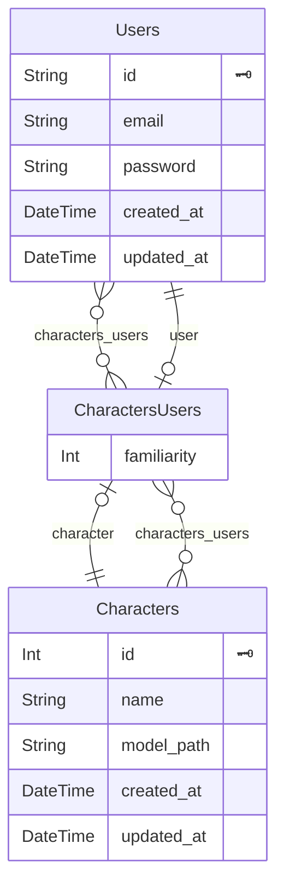

```mermaid
erDiagram

  "Users" {
    String id "🗝️"
    String email 
    String password 
    DateTime created_at 
    DateTime updated_at 
    }
  

  "Characters" {
    Int id "🗝️"
    String name 
    String model_path 
    DateTime created_at 
    DateTime updated_at 
    }
  

  "CharactersUsers" {
    Int familiarity 
    }
  
    "Users" o{--}o "CharactersUsers" : "characters_users"
    "Characters" o{--}o "CharactersUsers" : "characters_users"
    "CharactersUsers" o|--|| "Users" : "user"
    "CharactersUsers" o|--|| "Characters" : "character"
```
